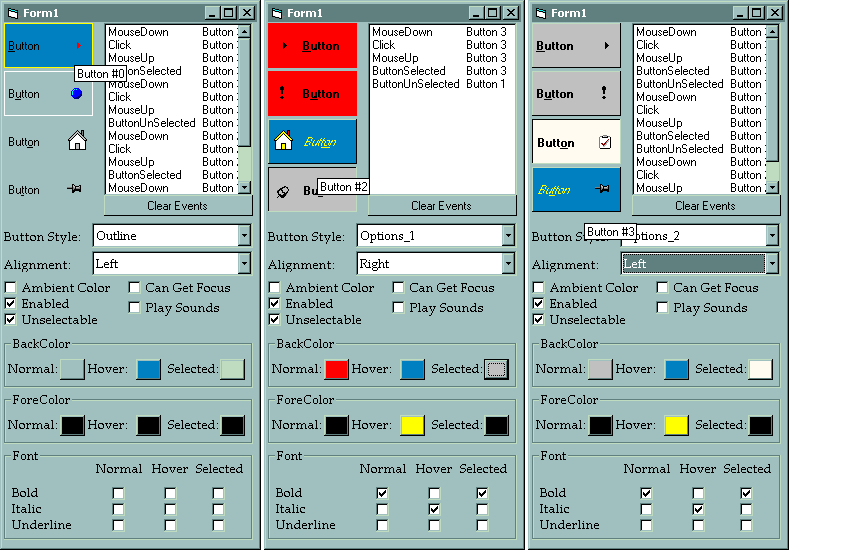



## Great button control with 6 styles

### Description

This is a great button control if you want to build professional-looking applications. It provides 6 different styles, including a Cool (Rebar) style, flat, standard (3D) and 2 different Options styles. Allows for different pictures, colors and fonts in all 3 states -- normal, hover and selected. Has all the other properties of a standard button, so it is a great replacement.  12/21 -- added Cancel and Default properties.

**Feedback is greatly appreciated**
 
### More Info
 
This wasn't initally intended for distribution, so the comments aren't so great.

This button is a much-expanded version of the SoftButton control, which is a downloadable example from the MS website. Same core drawing, tooltip, etc. code, but with a lot of extended capabilities.

             |
---                |---
**Submitted On**   |2000-12-21 22:11:50
**By**             |[Brian Schwalm](https://github.com/Planet-Source-Code/PSCIndex/blob/master/ByAuthor/brian-schwalm.md)
**Level**          |Advanced
**User Rating**    |4.6 (37 globes from 8 users)
**Compatibility**  |VB 5\.0, VB 6\.0
**Category**       |[Custom Controls/ Forms/  Menus](https://github.com/Planet-Source-Code/PSCIndex/blob/master/ByCategory/custom-controls-forms-menus__1-4.md)
**World**          |[Visual Basic](https://github.com/Planet-Source-Code/PSCIndex/blob/master/ByWorld/visual-basic.md)
**Archive File**   |[CODE\_UPLOAD1292412222000\.zip](https://github.com/Planet-Source-Code/brian-schwalm-great-button-control-with-6-styles__1-12584/archive/master.zip)

### API Declarations

MANY

